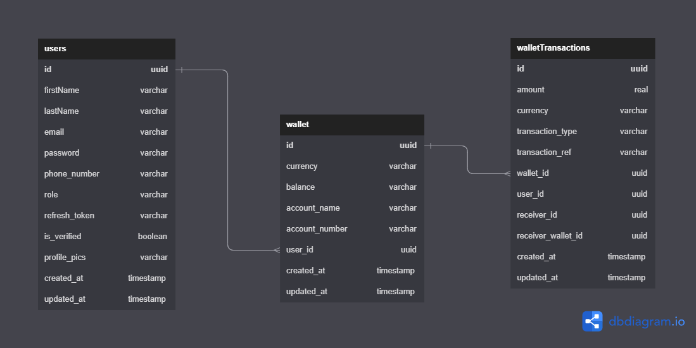
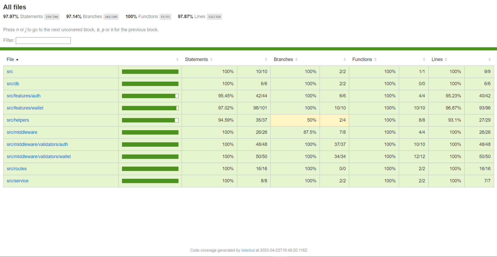

# Demo Credit

Demo Credit is a mobile lending app that requires wallet functionality. This is needed as borrowers need a wallet to receive the loans they have been granted and also send the money for repayments.

Required features for the MVP (Minimum viable product) wallet service include:

A user can create an account
A user can fund their account
A user can transfer funds to another user’s account
A user can withdraw funds from their account.

# Table of Content

- [Features](#features)
- [ER Diagram](#er-diagram)
- [Technologies](#technologies)
- [Installations](#installations)
- [Endpoints](#endpoints)
- [Tests](#tests)
- [Deployment](#deployment)
- [Documentation](#documentation)
- [Authors](#authors)

## Features

Here are the list of features Demo Credit API offers:

- Users can register on the platform
- Users can login to their account
- Users can create single wallet
- Users can fund their wallet
- Users can transfer funds to another user’s wallet
- Users can withdraw funds from their wallet
- Users can view their wallet balance

## ER Diagram

Here is the public link to the ER Diagram:
https://dbdiagram.io/d/62177fff485e4335430ef7f4



## Technologies

The application was built, tested and deployed with the following technologies:

- [Typescript](https://www.typescriptlang.org/)
- [NodeJS](https://nodejs.org/en/)
- [ExpressJS](https://expressjs.com/)
- [Mysql](https://dev.mysql.com/downloads/mysql/)
- [Knex ORM](https://knexjs.org/)
- [Mocha](https://mochajs.org/)
- [Chai](https://www.chaijs.com/)
- [railway](https://railway.app/)

## Installations

These instructions will get you a copy of the project up and running on your local machine for development and testing purposes:

- Install [NodeJs](https://nodejs.org/en/download/) and [Mysql](https://dev.mysql.com/downloads/mysql/) database on your computer.
- Clone the git repository using `git clone https://github.com/Johnsonojo/lendsqr-be-test.git`
- Create your development and test databases and add their credentials to the `.env` file. Check the `.env.example` file in the root directory of the project for the required environment variables.
- Run `yarn install` on the command line to install all dependencies.
- Run `yarn run db:reseed` to setup and seed data into your development database.
- Run `yarn run dev` to start the development server.
- Open postman and verify all shortlisted endpoints.

## Endpoints

_**baseUrl: http://localhost:8000/api/v1**_

### `POST /auth/signup`

Registers a new user. Requires the following required request body:

```json
{
  "first_name": "your first name",
  "last_name": "your last name",
  "email": "your@email.com",
  "password": "your password",
  "phone_number": "+2341234567890"
}
```

Sample response body:

```json
{
  "message": "User registered successfully",
  "status": "success",
  "data": {
    "id": "uuid of the user",
    "first_name": "your first name",
    "last_name": "your last name",
    "email": "your@email.com",
    "phone_number": "+2341234567890",
    "role": "user"
  }
}
```

### `POST /auth/login`

Logs in a user. Requires the following required request body:

```json
{
  "email": "your email",
  "password": "your password"
}
```

Sample response body:

```json
{
  "message": "Login successful",
  "status": "success",
  "data": {
    "user_id": "uuid of the user",
    "first_name": "your first name",
    "role": "user",
    "access_token": "jwt access token",
    "refresh_token": "jwt refresh token"
  }
}
```

#### Note:

`The following endpoints requires authorization using the access token provided in the login request header`

### `POST /wallet/create`

Creates a single wallet for a user. Requires the following required request body:

```json
{
  "currency": "NGN"
}
```

Sample response body:

```json
{
  "message": "Wallet created successfully",
  "status": "success",
  "data": {
    "id": "d9ceabe7-5a80-42b5-99bf-82cbe733bb4d",
    "user_id": "ef2d0d89-c523-447d-9f07-473c90726cc1",
    "balance": "0.00",
    "currency": "NGN",
    "account_name": "Vivian Robinson",
    "account_number": "1584544291",
    "created_at": "2023-04-23T12:19:51.000Z"
  }
}
```

### `POST /wallet/fund/:account_number`

Funds a user's wallet. Requires the following required request body:

```json
{
  "amount": 1000
}
```

Sample response body:

```json
{
  "message": "Wallet funded successfully",
  "status": "success",
  "data": {
    "id": "4eb171f2-d1ba-40d9-946a-5e17a5c9c860",
    "currency": "NGN",
    "balance": "wallet balance",
    "account_name": "Vivian Robinson",
    "account_number": "4784966734",
    "user_id": "ef2d0d89-c523-447d-9f07-473c90726cc1",
    "created_at": "2023-04-23T12:15:43.000Z",
    "updated_at": "2023-04-23T12:15:43.000Z"
  }
}
```

### `POST /wallet/transfer/:account_number`

Transfers funds from a user's wallet to another user's wallet. Requires the following required request body:

```json
{
  "amount": 1000,
  "receiver_account_number": 5489499737
}
```

Sample response body:

```json
{
  "message": "Fund transferred successfully",
  "status": "success",
  "data": {
    "id": "4eb171f2-d1ba-40d9-946a-5e17a5c9c860",
    "currency": "NGN",
    "balance": "11500.00",
    "account_name": "Vivian Robinson",
    "account_number": "4784966734",
    "user_id": "ef2d0d89-c523-447d-9f07-473c90726cc1",
    "created_at": "2023-04-23T12:48:50.000Z",
    "updated_at": "2023-04-23T12:48:50.000Z"
  }
}
```

### `POST /wallet/withdraw/:account_number`

Withdraws funds from a user's wallet. Requires the following required request body:

```json
{
  "amount": 1000
}
```

Sample response body:

```json
{
  "message": "Fund withdrawal successful",
  "status": "success",
  "data": {
    "id": "4eb171f2-d1ba-40d9-946a-5e17a5c9c860",
    "currency": "NGN",
    "balance": "11500.00",
    "account_name": "Vivian Robinson",
    "account_number": "4784966734",
    "user_id": "ef2d0d89-c523-447d-9f07-473c90726cc1",
    "created_at": "2023-04-23T12:48:50.000Z",
    "updated_at": "2023-04-23T12:48:50.000Z"
  }
}
```

These last endpoint is added for testing purpose. It is not part of the MVP requirements. It is added so that the user can get their wallet details after performing any of the above operations.

### `GET /wallet/:account_number`

Gets a user's wallet by account number.

Sample response body:

```json
{
  "message": "Wallet retrieved successfully",
  "status": "success",
  "data": {
    "id": "4eb171f2-d1ba-40d9-946a-5e17a5c9c860",
    "currency": "NGN",
    "balance": "11000.00",
    "account_name": "Vivian Robinson",
    "account_number": "4784966734",
    "user_id": "ef2d0d89-c523-447d-9f07-473c90726cc1",
    "created_at": "2023-04-23T12:48:50.000Z",
    "updated_at": "2023-04-23T12:48:50.000Z"
  }
}
```

## Tests

Run `yarn test` on the command line to run the unit tests.

### Test Coverage

This is the test coverage for the project:



## Deployment

_Demo Credit API hosted on railway_:
https://johnson-ojo-lendsqr-be-test.up.railway.app/

## Documentation

_Demo Credit API postman collection_:
https://documenter.getpostman.com/view/10756653/2s93Y5PKPe

## Author

Johnson Ojo
